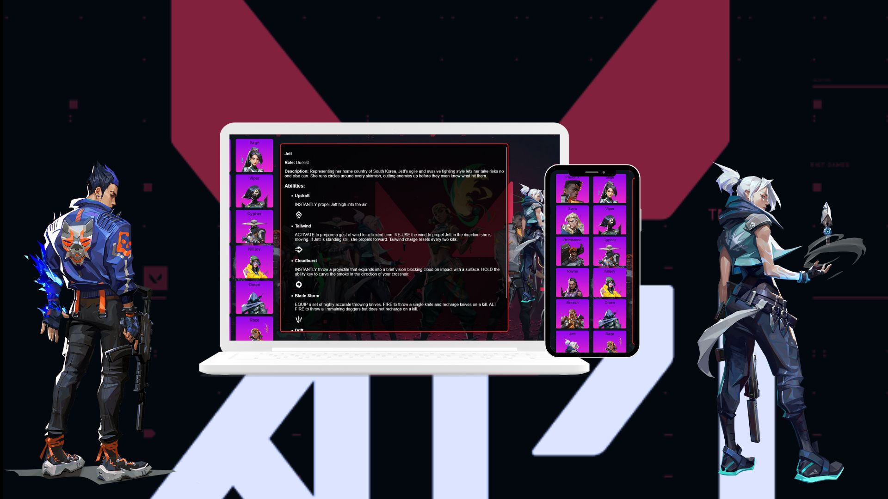

# Welcome to API Mashup Assignemt
Welcome to our API Mashup Assignment project! This project is all about leveraging the power of Vue.js and Lumen to create something innovative by combining local and public APIs. We chose to focus on the Valorant API for two compelling reasons. Firstly, Valorant is currently one of the most popular FPS games, making it a great choice for our project. Secondly, the Valorant public API provided all the necessary information we needed, ticking all the checkboxes for our requirements.

# Why valorant API

Popularity: Valorant is one of the leading FPS games in the gaming industry, ensuring a wide audience appeal.

Comprehensive API: The Valorant API offers a rich set of data and functionalities, perfectly aligning with our project goals.

# Implementation Approach

In our project, we've strived to implement some of the best practices taught in our classes to ensure the highest level of creativity and functionality. By following these practices, we aim to deliver a project that not only meets but exceeds expectations.

# About Valorant

Valorant is a free-to-play multiplayer tactical first-person shooter developed and published by Riot Games. It was officially released on June 2, 2020, and has since gained massive popularity in the gaming community.

# Technologies Used

Vue.js: A progressive JavaScript framework for building user interfaces. Vue.js provides a flexible and efficient way to develop interactive web applications.
Lumen: A stunningly fast micro-framework by Laravel for building scalable and efficient APIs. Lumen allows us to create powerful APIs with minimal overhead.

# Project Goals

Our primary goal with this API Mashup Assignment is to create an innovative application that seamlessly integrates local and public APIs, providing users with a unique and engaging experience. Through our project, we aim to demonstrate our proficiency in Vue.js and Lumen while showcasing our creativity and problem-solving skills.

# Overview

Document Structure: The document begins with standard HTML5 declarations and meta tags for character encoding and viewport settings.

Title and Stylesheets: The title of the webpage is set to "Valorant Agents," and external CSS files, main.css and grid.css, are linked for styling.

Vue.js Setup: The Vue.js framework is imported from a CDN, and the main JavaScript file local-characters.js is included as a module.

Body Content: Within the body, the Vue.js app is mounted to the #app div. It consists of a grid layout displaying agent information and details.

# Javascript
The JavaScript file local-characters.js contains the logic for fetching agent data and dynamically updating the webpage. Here's an overview:

Vue App Creation: We create a Vue app instance and utilize the created lifecycle hook to fetch agent data from a local API.

Data Management: The app manages data related to agents, agent details, and error messages using reactive properties.

Methods: The app defines a method getAgent(agentName) to fetch detailed information about an agent when its name is clicked.

API Interaction: The method getAgent(agentName) fetches agent details from the Valorant API based on the provided agent name.

Error Handling: The app handles errors gracefully by displaying appropriate error messages if data fetching fails.

Rendering: The fetched agent details are rendered dynamically on the webpage, updating the agent's name, role, description, abilities, and portrait image.

# History
1.0 - Made the skeleton Ready with the html, sass and js
2.0- lumen and vue.js set up
3.0- resolved errors in the overall project
4.0- Throughly worked on responsiveness.

# How To Use
1. Clone the repo / Download the files
2. Load it in your system
3. Run it with Vscode and open the live server. Have fun

# License 
MIT

# Special Thanks
Professor Marco De Luca 
(co-ordinator of IDP at Fanshawe School Of Digital and Performing Arts)
Professor Rob Haaf 
(Professor of IDP at Fanshawe School Of Digital and Performing Arts)

# Team 
Aiden Wotton
Dev Pandya
